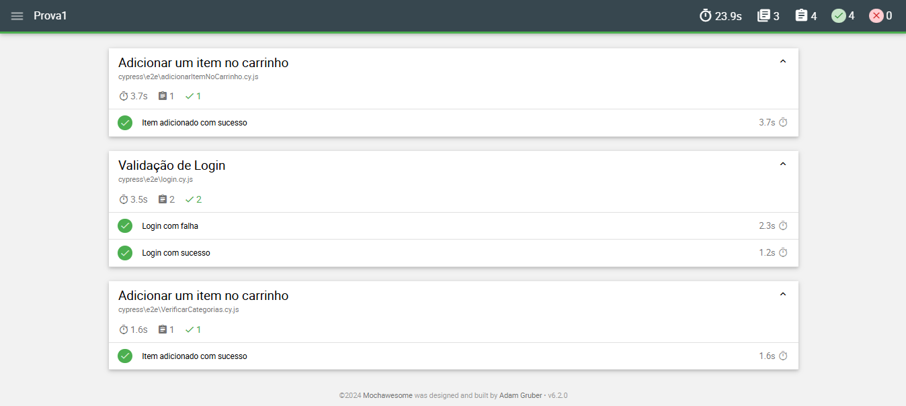

# Cypress Test Automation

Este projeto utiliza **Cypress** para automação de testes end-to-end com relatórios gerados pelo **Mochawesome**.

## 📝 Casos de Teste

A seguir, uma descrição dos principais casos de teste implementados:

1. **Login**  
   - Verifica se o usuário consegue realizar o login com credenciais válidas.
   - Valida mensagem de erro para credenciais inválidas.

2. **Visibilidade de Elementos**  
   - Verifica se os itens do menu estão visíveis na interface.

3. **Interação com Formulários**  
   - Preenchimento e envio de formulários.
   - Validação de mensagens de sucesso e erro.

4. **Alertas**  
   - Valida mensagens exibidas em pop-ups (alertas).

5. **Navegação**  
   - Garante que o redirecionamento funciona corretamente após ações do usuário.

## 🚀 Como Rodar o Projeto

### Pré-requisitos

- Node.js (v14 ou superior) instalado
- NPM ou Yarn instalado

### Instalação

1. Clone o repositório:
   ```bash
   git clone https://github.com/Matheus-Bernardo/S206---Qualidade-de-software.git
   npm i
   cd lab/Prova1 e rode o comando npx cypress run


### Resultados
O resultado dos testes podem ser vistos através do relatório localizado em ~cypress/e2e/reports/index.html





